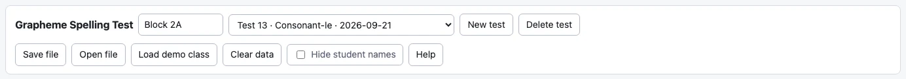
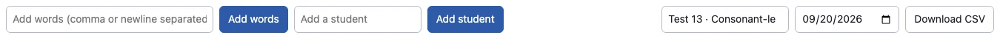
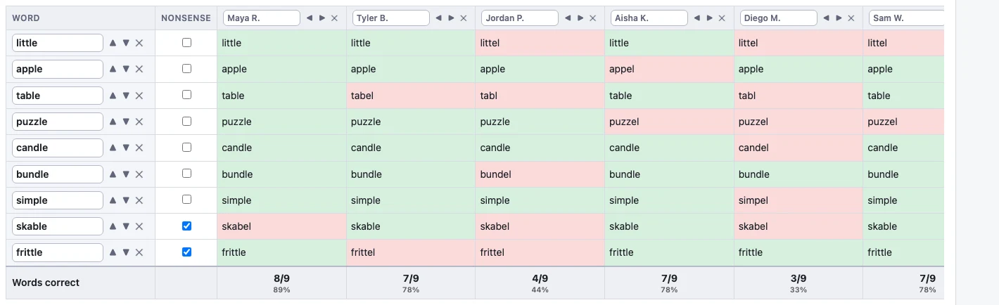

# Getting started: entering a test

Everything starts on the **Spelling test** tab. You type in the words you
dictated and what each student actually wrote; every other tab in the app is
built from that one grid.

If you would rather poke at a finished example than start from scratch, press
**Load demo class** in the toolbar. It fills the app with a made-up class of
eight students tested every two weeks for six months, so every report has
something in it. **Clear data** empties it again.



## Name the test

The dropdown at the top left chooses which test you are working on. **New test**
starts another one, and the name and date boxes above the grid let you label it.

Give tests names you will recognise a year from now. The reports list them by
name, and the **Progress over time** tab puts them in date order along the top,
so a name like `Test 4` tells you nothing while `Unit 6 – consonant-le` tells you
exactly what was being taught that fortnight.

The date matters too: it is what orders the tests, so set it to the day you gave
the test rather than leaving whatever the box started with.

## Add the words

Type the words you dictated into the **Add words** box. You can paste in a whole
list at once — separated by commas, or one per line — so a word list you already
have in a document goes in with one paste.



Tick **nonsense** next to any word you made up. Nonsense words are the useful
because a student who writes `frittle` correctly has actually decoded it, while
`little` might just be a word they have seen a thousand times. The tool will 
analyze them the same way, but the tick reminds you which is which when you are
reading a student's results.

The small arrows next to each word move it up or down, and the ✕ deletes it. If
a word already has spellings recorded against it, the ✕ asks you first and tells
you how many you are about to throw away.

## Add the students

Type each name into **Add a student** and press Enter.

Your class is shared across every test, so you only do this once. Making a new
test does not mean re-entering the roster — everyone is already on it, and a
student who missed that day simply has an empty column.

If you removed someone and want them back, an **Add from an earlier test**
button appears next to *Add student*. Their old spellings were kept, so they
come back with all of their previous work and its analysis intact.

## Record what each student wrote

Now type. Each row is a word, each column is a student.



**You do not need the mouse for this part.** Working from one student's paper,
press <kbd>Enter</kbd> after each spelling and the cursor drops to the next word
down that student's column. At the bottom of the column it jumps to the top of
the next student's. <kbd>Shift</kbd>+<kbd>Enter</kbd> goes back up, and
<kbd>Tab</kbd> moves across the row if you would rather mark word by word.

Type exactly what the student wrote, misspellings and all. A cell turns green when the spelling matches the target word exactly and
red when it does not.

With a big class the grid scrolls sideways, but the word and nonsense columns
stay pinned to the left so you can always see what was dictated.

The **Words correct** row at the bottom gives each student a plain score out of
the number of words on the test, with a percentage.
Althought, tt counts blanks as not correct, it also tells you how many
blanks there were, so an absent student's low score is not mistaken for a
struggling one's.

## Saving your work

Your data saves automatically in the browser you opened the app in. That is
convenient, but it is not a backup — clearing your browsing data erases it, and
it does not follow you to another computer.

- **Save file** writes everything — students, tests, words, spellings and your
  corrections — to a single `.json` file wherever you keep your documents.
- **Open file** loads one back.

Nothing is ever sent anywhere. There is no account, no server and no upload; the
file on your computer is the only copy, which is also why it is worth keeping
one.

### Using files to keep classes and years apart

One file is one set of students and tests.
You are free to create and organize files any way you want, 
but a suggestion would be to create one file per class year.

For example:
```
Period 2 – 2025-26.json
Period 4 – 2025-26.json
Reading group – 2024-25.json
```

Open the one you want to work on, and **Save file** when you are done. Dated
copies (`Period 2 – 2025-26 – March.json`) give you something to go back to if a
day's marking goes wrong.

Because previous years stay in their own files, you can open last year's and
read its reports exactly as they were, then open this year's again.

### The files are plain JSON

The saved file is ordinary JSON — plain text in a documented, standard format.
If your district's data person, an evaluator, or a graduate student wants to do
something the app does not do, every programming language in common use reads
JSON without any special library, and the file has everything in it: the words,
who wrote what, and every correction you made.

This is deliberate. Your data should not be stuck in a tool.

## Getting results out

Every tab has two buttons in its toolbar:

- **Download CSV** saves that tab's table exactly as shown, ready to open in
  Excel or Google Sheets, or to paste into a report. The drill-down windows have
  their own **Download CSV** too, so you can export just the examples behind one
  number.
- **Print / Save PDF** opens your browser's print dialog. Choose *Save as PDF*
  as the destination to get a file you can email or attach to an IEP. The
  toolbar, tab strip and buttons are left out of the printed version, and the
  colours are kept.

  Pages are set up as landscape with **half-inch margins**, so reports have
  room to breathe and nothing sits in the strip at the edge of the paper that
  most office printers cannot reach. If your PDF comes out edge to edge anyway,
  check the **Margins** setting in the print dialog — if it is set to *None* or
  *Minimum*, the browser is overriding the page. Set it back to *Default*.

Both of them follow whatever you have on screen — the tests you picked, the
student you chose, and whether names are hidden.
