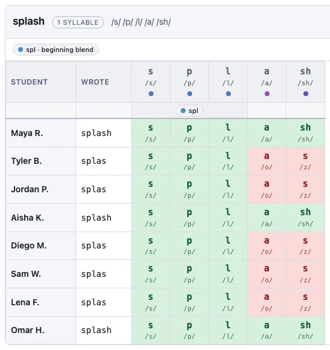
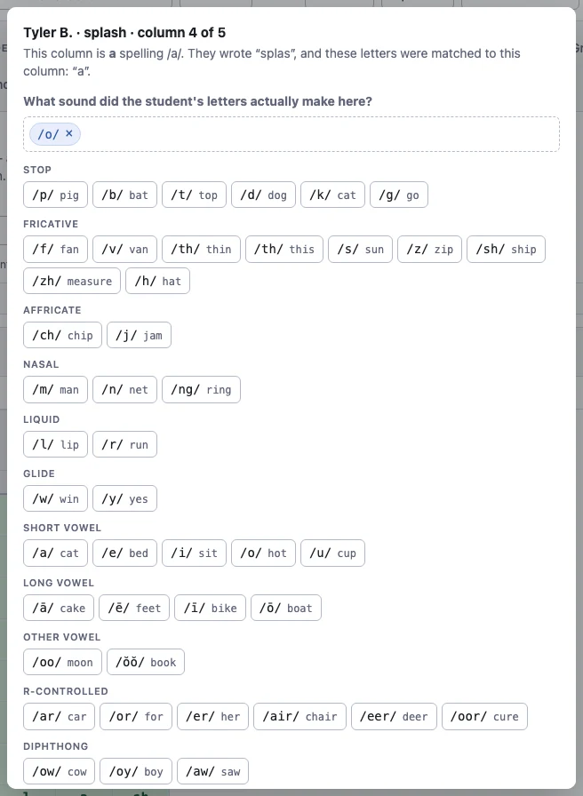
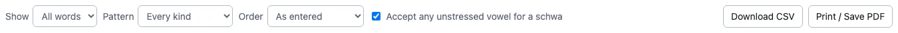

# Checking the analysis

Once the spellings are in, open the **Grapheme analysis** tab. This is where the
app shows its working — and where you check it before trusting anything built on
top of it.

Every report in the rest of the app is derived from this grid so it's 
important to review the results for accuracy. 

## What you are looking at

Each target word is broken into **graphemes**: the letters that spell one sound.
Each grapheme gets a column, with the sound it makes written underneath.

| Word | Columns | Why |
|---|---|---|
| ship | `sh` `i` `p` | `sh` is one grapheme making one sound |
| box | `b` `o` `x` | `x` is one letter making *two* sounds, /k/ + /s/ |
| bank | `b` `ank` | the velar nasal unit is taught whole, so it stays whole |
| little | `l` `i` `ttle` | consonant-le is taught whole too |
| splash | `s` `p` `l` `a` `sh` | a blend stays as separate columns, tagged across the top |

Blends are deliberately *not* collapsed. If a student writes `sash` for `splash`,
you want to see that the `p` and `l` went missing rather than just "blend:
wrong".

Each column carries a tag saying what kind of unit it is — consonant digraph,
short vowel, r-controlled, and so on. These tags are the categories every report
groups by. The full list of what counts as what is published with the app in
`PHONEME-CATEGORIES.md`. Each category is color coded, with a guide available
under "SOUND AND PATTERN SOUNDS IN THIS TEST".

## The four colours

Each student's attempt is lined up against those columns, and each cell gets one
of four colours:

| Colour | Means | Example |
|---|---|---|
| **Green** | Right sound, spelled the way this word spells it | `ship` → wrote `sh` |
| **Amber** | Right sound, spelled a different legal way | `cat` → wrote `kat` |
| **Red** | Wrong sound | `ship` → wrote `chip` |
| **Grey** | Left out | `splash` → wrote `sash` |

**Amber is phonetically correct, but the wrong grapheme** A student who writes
`fone` for `phone` has heard the "f" sound correctly but chosen the wrong spelling.
A student who writes `fun` for `phone` has not. Those two need
 different teaching, which is why they are coloured
differently — and why the by-sound reports later on let you decide whether amber
should count as correct or not.

## Red words

Some letters make a sound they simply do not usually make, and no amount of
sounding out gets you there — the `ai` in *said*, the `eir` in *their*, the `o`
in *come*. Those columns are tagged **Red word (irregular)** instead of the
phonics category they would otherwise fall in.

That tag is doing real work. Without it, a student who writes `thar` for *their*
looks like they cannot do r-controlled vowels, when what they actually cannot do
is remember one word. With it:

- the `th` still counts as a **consonant digraph**, and it counts as *correct*,
  because they got it right;
- the `eir` counts as a **red word**, and nothing else;
- r-controlled vowels are left out of it entirely — that skill was never really
  tested by this word.

So a low red-word score means *practise these particular words*, and a low
r-controlled score still means *reteach bossy R*. They no longer contaminate
each other.

**It is the letters that are red, not the word.** The `ai` in *said* is tagged
red; the `ai` in *rain* is an ordinary long vowel. They make different sounds, so
the app was already treating them as different things.

This happens automatically, from an internal list.  Ticking the **Red** box next to a word on the spelling test
tab does not change the marking — it labels the word for you throughout the app,
and tells you if the app does *not* recognise an irregular part in a word you
think has one.  Provide feedback to the app on the github page (see about) section if you find some examples that are missing persistently. 

The **By sound** tabs are deliberately left out of this. They ask whether the
student heard the sound, which is a fair question about a red word too: `thar`
for *their* really is /ar/ where /air/ was wanted, and that still shows up there.

## Check it, then correct it

The app works out pronunciations with a real speech engine rather than a list of
rules, so it handles nonsense words and irregular words well. It is not perfect.
Names, unusual words and words with more than one pronunciation are where it
slips.

You should check its work, especially for any usual words or spellings, 
and look for cells where the colour does not match what you know about the student.

**To fix one student's grapheme cell,** click it. A window opens showing what that column
is, what the student wrote, and which of their letters were matched to it. Set
what sound their letters actually made, choose the result from the dropdown, and
save. **Undo my edit** puts it back the way the app had it.

**To fix the word itself,** use **Edit breakdown** next to the word. That changes
the sounds in the target word for the whole class at once, which is what you want
when the engine has mispronounced a word rather than misread one student. A word
you have edited is labelled *breakdown edited* so you can see at a glance which
ones you have vetted.

Your corrections are saved with your data and flow straight into every report.

## The options along the top

- **Show** narrows the grid to a single word, which is the quickest way to check
  one word across the whole class.
- **Pattern** shows only the words containing one kind of unit. For example, 
  every word with an r-controlled vowel. This is useful when you want to focus
  on words that tested a particular category you had recently focused on teaching.
- **Order** switches between the order you typed the words in and grouping them
  by the kind of unit they contain.

## Deciding about unstressed vowels

The last tick box is **Accept any unstressed vowel for a schwa**.

In ordinary speech, vowels in unstressed syllables collapse into a single neutral
sound called a **schwa** (/ə/). The second vowel in `tablet` is not really a
short /e/ — say it at normal speed and it is a schwa. The same happens in the
first syllable of `about` and the last of `pencil`.

That creates a marking problem. If a student writes `tablit`, have they made a
vowel error? They have written a letter that makes exactly the sound that is
actually there.

- **Ticked (the default):** any unstressed vowel is accepted where a schwa is
  needed. `tablit` is not counted as a vowel error. This allows you to focus
  on the cases where students don't hear certain sounds, or don't know how to
  write certain sounds.
- **Unticked:** the student must write the vowel the word uses. Stricter, and
  appropriate when you are specifically teaching schwa spellings and want to see
  who has them.

A stressed vowel is always marked strictly either way, so `hop` for `hope` is
wrong no matter how this is set.

