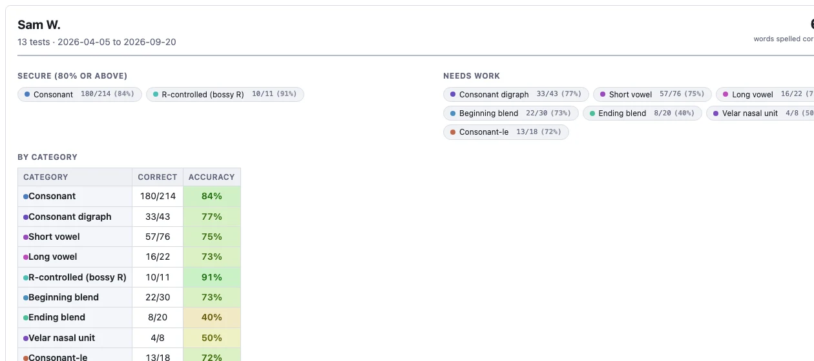
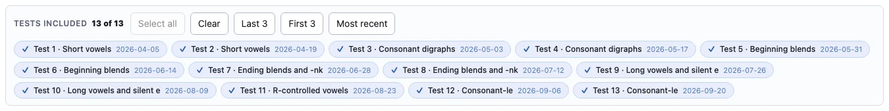
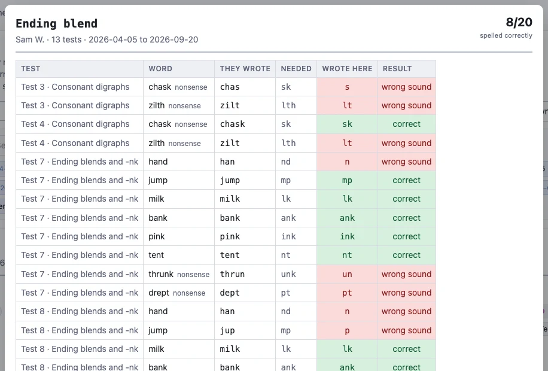

# Student profile

A detailed per student breakdown, designed to help provide documentation 
for the performance of individual students. For example, it might be helpful
to create a record for an IEP meeting, a parent conference, or a
conversation with a case manager.

## One test, or a whole term

The row of chips under the toolbar decides which tests the page covers.

Click a test to add or remove it, or use the shortcuts:

- **Select all**, **Clear**,  **Last 3**, **First 3**, **Most recent** 

Everything on the page pools across whatever you have selected, so the same page
serves a single lesson's test, a "how is it going" conversation, and a whole
year's evidence. With one test selected you also get the full word list for that test.
With more than one, you get a test-by-category score table summary.

Choosing **All students** from the Student dropdown prints one page per student,
which is how you get the whole class's profiles in a single PDF, but with page
breaks between students. 

## Secure, and needs work

The top of the page splits the phonics categories in two at **80% accuracy**:

- **Secure (80% or above)** — the things this student can do.
- **Needs work** — the things below that line.
- **Not assessed on these tests** — listed separately,.

Underneath, **By category** gives every category its fraction and its percentage,
colour-coded for easy visual identification of the weak and strong categories.

## The particular mistakes they made

Below the table are the errors themselves, quoted with the word they came from:

> wrote **s** for `sh` in **ship**

and they are split into two lists:

- **Wrong sound** — the student did not hear or encode the sound. This is a
  phonological problem.
- **Right sound, wrong spelling** — the student heard it correctly and picked a
  spelling the language does not use for that word (`kat`, `fone`). This is an
  orthographic problem.

## Click any score to see the evidence

Every fraction and percentage on this page (and most pages) is clickable.
Clicking opens a window listing every single answer behind that number 
— which word, what the student wrote for that one unit, and whether it counted.

Each of these modals has it's own **Download CSV** if you want to record 
some specific errors for planning purposes or showing a student their  
specific mistakes. 

## Printing without the other students' names

The **Hide student names** tick box in the toolbar replaces every name in the
app — on screen, in printouts, and in CSV exports — with *Student 1*,
*Student 2*, and so on.

Turn it on when you want to anonymize the data, such as showing someone where
a student sits relative to the class, or are aggregating data for a study
that does not need access to personally identifiable information.
