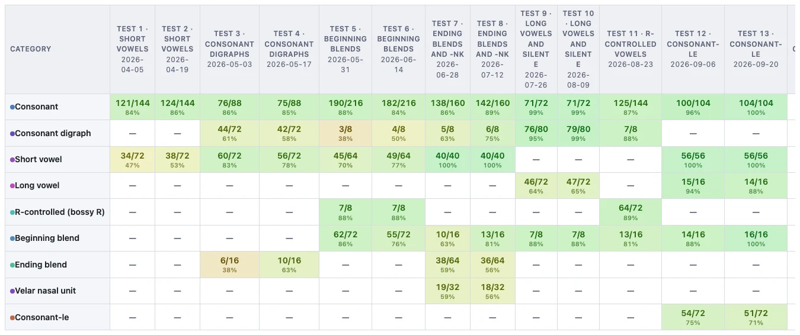

# Progress over time

Every other report is a snapshot. This one organizes the data by test date. 
Oldest on the left, newest on the right, broken by down category. 

## Whole class, or one student

The **Student** dropdown switches between **Whole class** and any individual.

## By category, or by individual grapheme

The **Rows** dropdown decides how finely the table is cut.

- **By category** is the default, groupes grapheme's by their broad categories.
- **By spelling** drills down to individual graphemes — `sh`, `ck`, `ai`. Sharper,
  but a particular grapheme may only have appeared on three of your twelve tests,
  so expect a sparser table.

If a category or grapheme did not appear on a test, that cell shows a grey **—**.

## Click any cell for the examples behind it

As everywhere else in the app, every score in the table is clickable. Clicking
one opens the individual answers that produced it, and the ability to produce
a specific csv file of those examples.

