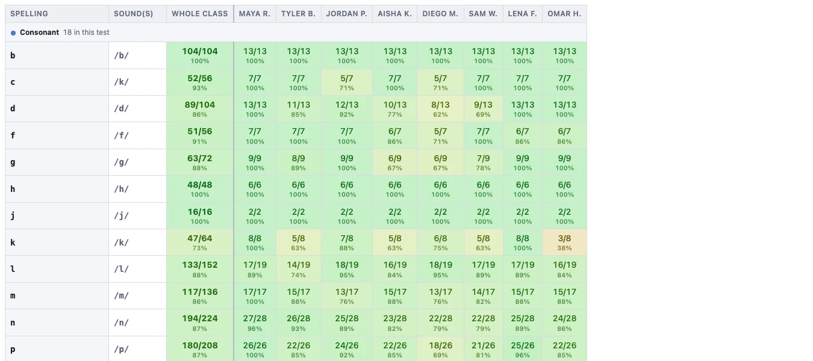

# Accuracy by grapheme

The first of the two **By spelling** reports. It answers one question: *how often
did each spelling get written correctly?*

Every row is one grapheme — `sh`, `ck`, `oa`, `-ttle` — with a column per student
and the **whole class** column first, so you can read the class position before
the individuals.

The rows are grouped under the phonics categories, so a whole category reads at a
glance. Patterns that span several columns, like the `dw` in *dwell*, 
get a row of their own too, and count as correct only when every column 
they cover is correct.

## It pools across whatever tests you choose

The test picker at the top works exactly as it does on the student profile. Click
chips to add or remove tests, or use **Select all**, **Last 3**, **First 3** and
**Most recent**.  More tests will add more data and make differences more 
statistically valid, but averaging over larger time periods can obscure growth.

## Counting amber

The tick box **Count "right sound, different spelling" as correct** decides what
this report is measuring.

- **Unticked:** only exact spellings count.
- **Ticked:** amber counts as correct, and the report becomes a measure of
  hearing the sounds rather than spelling them.

The setting is shared with the by-sound reports, so if you tick it here you will
find it ticked over there too.

## Click any score for the examples behind it

As on the other pages, each individual cell is clickable to get the examples 
behind that number.
