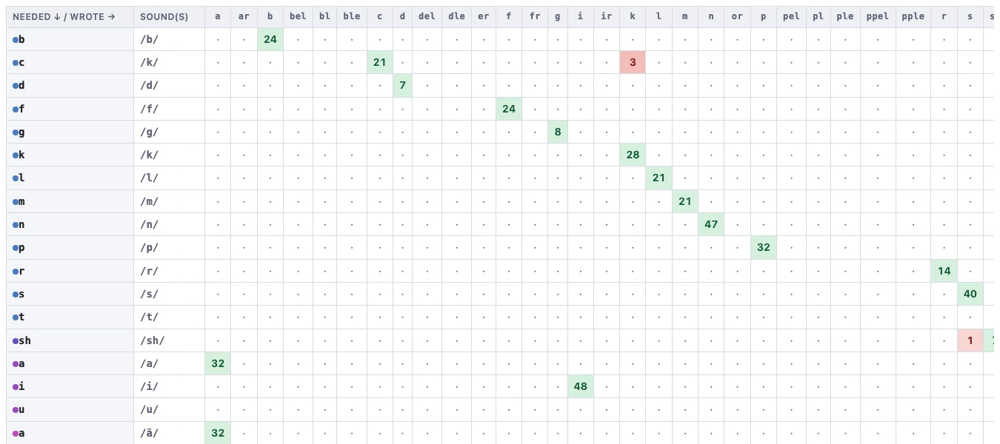

# Grapheme confusion

Accuracy tells you *that* a spelling went wrong. This tells you *what went in
its place*.

## Reading the grid

It is a grid of needed against written, and the header says which way round:
**Needed ↓ / Wrote →**.

- **Rows** is the spelling the word needed.
- **Columns** is what the student rote. Err, I mean wrote. 

Where the two agree you are on the **shaded green diagonal**: the spelling that
was needed is the spelling that appeared. Everything off the diagonal is a
substitution, shaded **red** and marked with the number of times it happened.

A column marked **∅** means nothing was written for that unit at all. 

So a `7` where the row is `ck` and the column is `k` reads: *seven times, a word
needed `ck` and the student wrote `k`.* 

**Hide empty rows and columns** clears out everything that never came up, which
is worth ticking once the grid gets wide, but the correct items will no
long show up along the diagonal, so use the green color to identify them. 

The **Showing** dropdown switches between the whole class and any individual.

## Click any cell for the examples

As with other pages, every cell with a number in it is clickable to get the 
specific examples under the number.

You might find drilling into the different examples along a row or column
and comparing the correct and incorrect cases to be useful. 

As everywhere else, the window has its own **Download CSV**.

## Pooling tests

The test picker at the top works as it does everywhere else. Confusions are
exactly the kind of thing that needs pooling: a single test might show one `ck`
→ `k`. 
