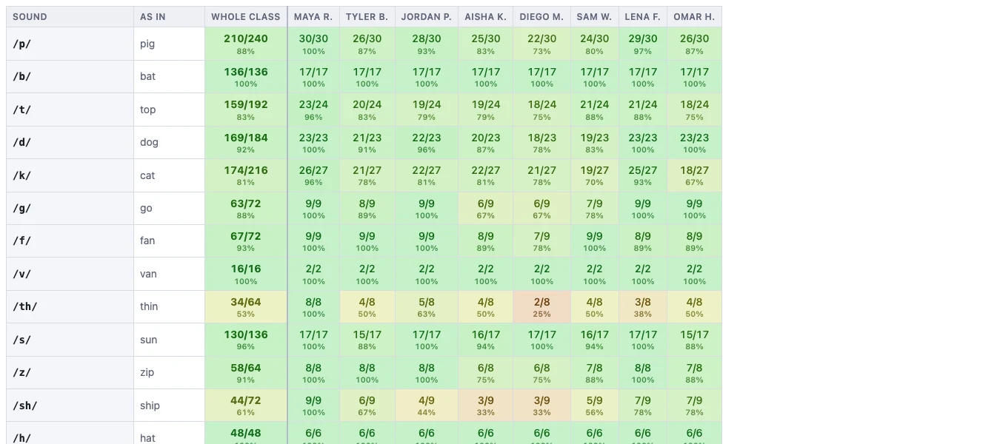

# Accuracy by phoneme

The three **By sound** tabs ask a different question from the by-spelling ones.
Not *did they pick the right letters?* but *did they hear the right sound?*

## Why sounds and spellings need separate reports

A **grapheme** is the letters that spell a sound. A **phoneme** is the sound
itself. They do not line up one to one — several different spellings make the
same sound:

| Sound | Spelled |
|---|---|
| /f/ | `f` in *fan*, `ph` in *phone*, `ff` in *cliff* |
| /k/ | `c` in *cat*, `k` in *kit*, `ck` in *duck*, `ch` in *school* |
| /ā/ | `a_e` in *cake*, `ai` in *rain*, `ay` in *day*, `ea` in *great* |

That matters because a spelling test failure can come from two completely
different places. A student who writes `fone` has heard every sound in *phone*
correctly and chosen a spelling English does not use for that word. A student who
writes `fun` has not heard the sounds. On the by-spelling reports both are just
wrong. Regroup the same data by sound and they separate.

If a student's errors cluster around a particular sound no matter how it is
spelled, the problem is underneath the spelling — they are not reliably hearing
or producing that sound — and no amount of spelling rules will fix it.

## The tick box that changes the question

**Count "correct sound, different letters" as correct** is the important control
on this page.

- **Ticked:** This is what makes the most sense for this page, if you are focused on
looking for sounds problems.
- **Unticked:** This could make sense to toggle to see if there is just confusion 
about what was to spell a particular sound in a particular context. 

Note, the setting is shared with **Accuracy by grapheme**, so it stays where you put
it to ensure consistency across pages.

## Otherwise it works like the grapheme report

Everything else on this page behaves exactly as **Accuracy by grapheme** does:

- Rows are grouped by category, with the **whole class** column first.
- The test picker at the top pools results across any tests you choose.
- The **Student** columns let you compare across the class, or read one child.
- **Click any fraction or percentage** to open every example behind it.
- **Download CSV** and **Print / Save PDF** follow whatever you have on screen.

