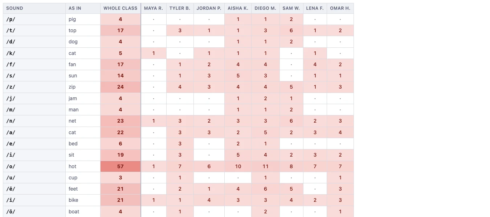

# Phoneme misuse

This page counts how often each sound was used **where it did not belong**.

## Turning the question around

**Accuracy by phoneme** groups the data by the sound that was *needed*: "when a
/sh/ was called for, how often did it appear?"

**Phoneme misuse** groups the same errors by the sound that was *written*: "how
often did a /ch/ turn up somewhere a /ch/ did not belong?"

It is the same set of mistakes, sorted by the other end. And it surfaces
something accuracy cannot: a **default**.

A student who is unsure might reach for a sound they are confident about. Spread
across an accuracy report, that could show up as a handful of unrelated small losses —
short *e* a bit low, short *i* a bit low, schwa a bit low. Sorted by what they
actually wrote, but viewed by incorrect sound, this collapses into one large number
say next to short *a*, because short *a* is what they write whenever they are not sure.

## Reading it

Rows are sounds; columns are students, with the **whole class** first. A high
number is a sound being over-used.

## The usual controls

- The **test picker** at the top pools the count across any tests you select. 
- **Click any number** to open the examples behind it.
- **Download CSV** and **Print / Save PDF** work as they do everywhere else.

