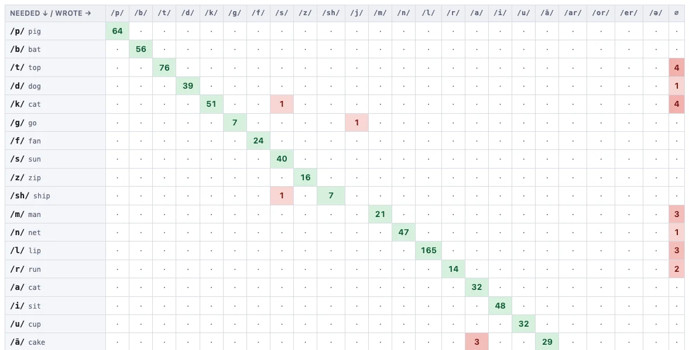

# Phoneme confusion

The sound-level twin of **Grapheme confusion**.
Grapheme confusion shows which *spelling* was written where another was needed;
this shows which *sound* was.

## Reading the grid

Same shape as the grapheme matrix:

- **Rows** are the sound the word should have written.
- **Columns** are the sound the student's letters maid (or is it made).
- The **green diagonal** is where the two agree — the sound was encoded
  correctly.
- Every **red** cell off the diagonal is a specific swap, with the number of
  times it happened. Darker red means more often.
- **∅** means the sound was left out altogether rather than replaced.

## Whole class or one student

The **Showing** dropdown switches between the two, and both are worth a look for
the same reasons as on the grapheme matrix: the class view finds the contrasts
nobody has secured, and the single-student view finds the personal substitution
that is quietly costing them marks across every test.

## The usual controls

- The **test picker** at the top pools the count across any tests you select. 
- **Click any number** to open the examples behind it.
- **Download CSV** and **Print / Save PDF** work as they do everywhere else.

---

That is the whole tour. If something in the analysis does not look right, the
place to go back to is **Checking the analysis** — every number in every report
on this tour is built from those coloured cells, and you can correct any of them.
